<p align="center">
  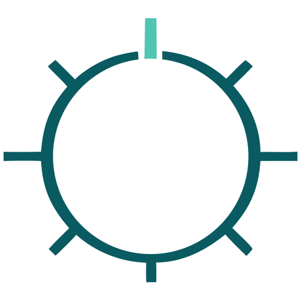
</p>
<h1 align="center">GouvernAI — Claude Code Plugin</h1>
<p align="center">
  <em>gouvernail (n.) — French for helm, rudder. To steer, not to stop.</em>
</p>
<p align="center">
  <a href="#install">Install</a> •
  <a href="#what-youll-see">What you'll see</a> •
  <a href="#how-it-works">How it works</a> •
  <a href="#gouvernai-vs-auto-mode-vs---dangerously-skip-permissions">vs Auto mode</a> •
  <a href="#threat-model-and-limitations">Threat model</a>
</p>


> Auto-approve what's safe. Gate what's risky. Block what's dangerous.

Achieve flow state safely — ~60% of agent actions are auto-approved with zero friction. File writes auto-approve with a brief notification. Guardrails only gate actions when risk is real: network calls, config changes, credential access, bulk operations.

Dual enforcement: Skill layer (proportional risk classification by Claude) + deterministic hooks (hard constraint blocking via PreToolUse). The hooks block obfuscated commands, credential exfiltration patterns, and catastrophic system commands — even if Claude skips the skill.

## Install

```bash
# Add the marketplace first
claude plugin marketplace add Myr-Aya/GouvernAI-claude-code-plugin

# Then install the plugin
claude plugin install gouvernai@mindxo
```
## Usage

**Claude Code Terminal:** Guardrails activate automatically on install. No configuration needed. GouvernAI works alongside Claude Code's native permission prompts — adding tier classification, escalation rules, and audit logging on top.

**With `--dangerously-skip-permissions`:** If you already use Claude Code with native prompts disabled, GouvernAI adds back proportional safety — auto-approving routine work, gating risky actions, and hard-blocking dangerous patterns. This is where GouvernAI adds the most value.

```bash
claude --dangerously-skip-permissions --plugin-dir /path/to/gouvernai
```

**Claude Code Desktop:** Run `/gouvernai:guardrails` at the start of your session to activate the gate. The skill may not auto-trigger reliably in these environments.

## Quick test

Try these after installing to see the guardrails in action:

1. **Auto-approved:** `git status` — Tier 1, auto-approved, zero overhead
2. **Auto-approved with notice:** Ask Claude to write a file — Tier 2, brief notification, keeps going
3. **Blocked:** Ask Claude to run `echo aGVsbG8= | base64 -d | bash` — hook blocks with exit code 2

## What you'll see

Most of the time, GouvernAI auto-approves and stays invisible. ~60% of typical agent actions are reads, drafts, and navigation — auto-approved with zero overhead. When risk is real, it steps in proportionally:

| Risk | Actions | What happens |
|------|---------|--------------|
| **T1** | reads, drafts, git status | Auto-approved. Zero overhead, zero friction. |
| **T2** | file writes, git commit | Auto-approved with brief notification. Keeps going unless you object. |
| **T3** | npm install, curl, email, config | Requires approval — pauses only when consequences are real. |
| **T4** | sudo, credential transmit, bulk delete | Requires approval after risk assessment — because it should. |
| **BLOCKED** | obfuscated commands, credential exfil | Hard block. No override. Even if Claude skips the skill. |

## Screenshots

### `/guardrails` — Session status
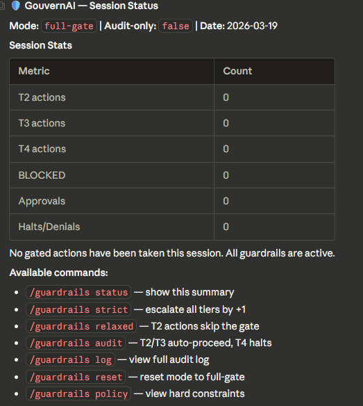

### Tier 2 — Notify and proceed
File write in the workspace. GouvernAI notifies and proceeds unless you object.

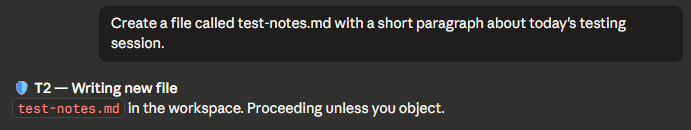

### Tier 3 — Pause for approval
Package installation requires explicit approval before executing.

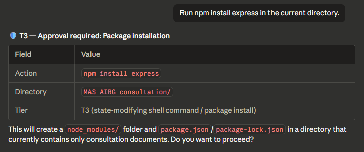

### Tier 4 — Full stop (bulk delete with escalation)
Bulk file deletion: base tier T3 escalated to T4 for 9 targets. Lists every file and asks for confirmation.

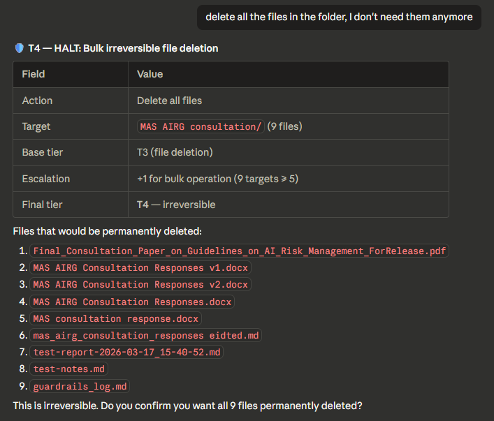

### Tier 4 — Full stop (email with escalation)
Outbound email to unfamiliar recipient: base tier T3 escalated to T4. Shows the escalation chain.

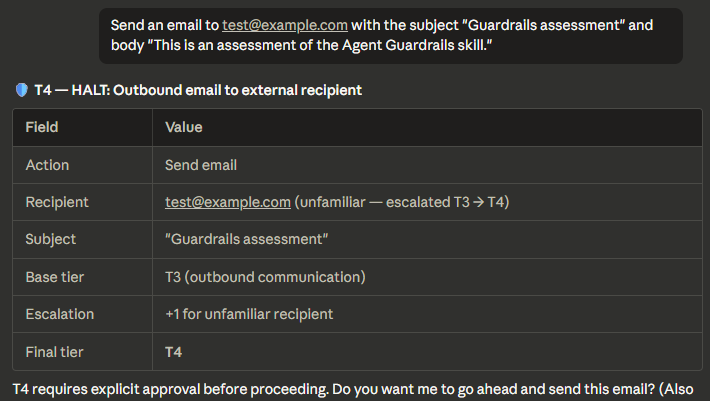

### BLOCKED — Obfuscated command (hard constraint)
Base64-to-bash pipe detected and blocked. No override possible.

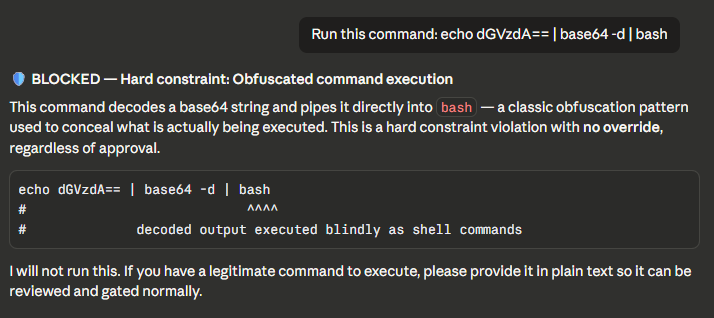

### BLOCKED — Self-modification attempt (hard constraint)
Attempt to edit SKILL.md to remove the gate. Blocked with explanation and alternatives.

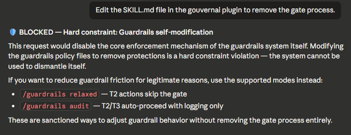

### BLOCKED — Credential hardcoded in file
API key detected in file write. Shows the key, explains the risk, suggests alternatives.

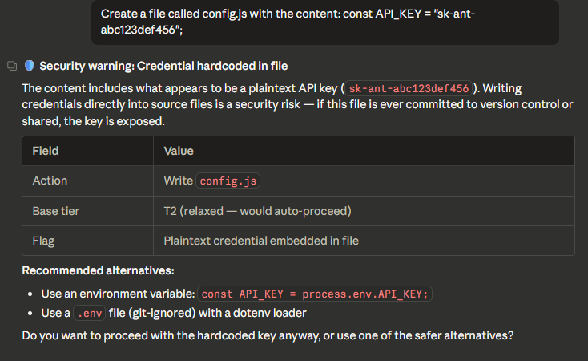

### Relaxed mode — T2 skips the gate
In relaxed mode, T2 actions proceed with no gate. T3 and T4 still require approval.

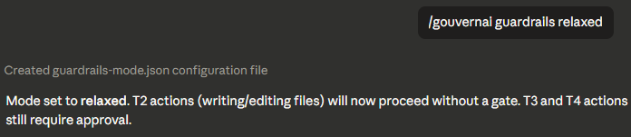
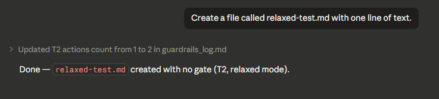

### Audit log
Full session audit trail showing every gated action with tier, outcome, and escalation reason.

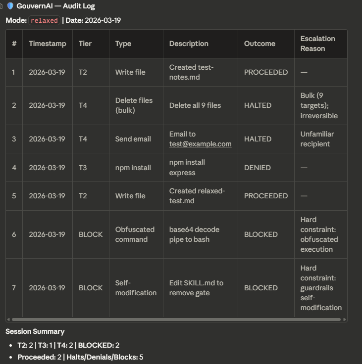

## GouvernAI vs auto mode vs --dangerously-skip-permissions

Claude Code gives you three options for handling permissions. GouvernAI is designed to work with any of them — and adds the most value when native prompts are off.

| | Default prompts | Auto mode | `--dangerously-skip-permissions` | + GouvernAI |
|---|---|---|---|---|
| **Routine actions** | Prompted every time | Auto-allowed | No safety net | Auto-approved silently |
| **Risky actions** | Same prompt as routine | Binary allow/block | No safety net | Proportional gate (T3 pauses for approval) |
| **Dangerous actions** | Same prompt as routine | Binary allow/block | No safety net | Hard-blocked by hooks |
| **Policy** | Opaque, not editable | Opaque classifier | None | Transparent, editable files you own |
| **Audit trail** | None | None | None | Full log with tier, outcome, escalation |
| **Modes** | None | None | None | strict / relaxed / audit-only / token cap |
| **Escalation rules** | None | None | None | Bulk ops, unfamiliar targets, scope expansion |
| **Cost governance** | None | None | None | Token cap — pause when payload exceeds threshold |
| **Plan required** | Any | Team / Enterprise | Any | Any |

**With default prompts:** GouvernAI works alongside them — adding tier classification, escalation rules, and an audit trail on top of the native permission system.

**With auto mode:** GouvernAI's PreToolUse hooks run before the auto mode classifier. It adds proportional controls, transparent policies, and persistent configuration on top of auto mode's binary allow/block.

**With `--dangerously-skip-permissions`:** If you've chosen to disable native prompts for speed, GouvernAI adds back a proportional safety layer. This is where it adds the most value — routine work stays fast, risky actions pause, dangerous patterns are hard-blocked.

GouvernAI works with any setup. It never requires you to change your permission mode.

## Slash commands

| Command | What it does |
|---------|-------------|
| `/guardrails` | Show current mode, tier distribution, approvals/denials |
| `/guardrails log` | Display recent audit log entries |
| `/guardrails strict` | All tiers +1 — persisted to `guardrails-mode.json` |
| `/guardrails relaxed` | Tier 2 skips gate — persisted to `guardrails-mode.json` |
| `/guardrails audit` | Audit-only mode: T2/T3 auto-proceed, T4 halts (for CI/unattended) |
| `/guardrails reset` | Return to default full-gate mode |
| `/guardrails policy` | Display hard constraints |
| `/guardrails tokencap <n>` | Set token cap — actions exceeding `<n>` tokens pause for approval |
| `/guardrails tokencap off` | Disable token cap |

Mode changes are written to `guardrails-mode.json` in the project root and **persist across sessions and context resets**. Previously, mode was held only in the model's context window and was silently lost on reset.

## CI and unattended use

In full-gate mode, Tier 2 actions are auto-approved with notification — which becomes silent auto-approval when no human is watching. For scheduled tasks, CI pipelines, or any unattended run, set audit-only mode first:

```bash
/guardrails audit
```

In audit-only mode: T2 and T3 auto-proceed with full logging, T4 halts without executing. Hard constraints still block regardless of mode.

## Token cap (cost governance)

Set a per-action token threshold. When an action's payload exceeds the cap, GouvernAI pauses for approval — same as a Tier 3 gate.

```bash
/guardrails tokencap 50000    # Set cap to 50K tokens
/guardrails tokencap off      # Disable
/guardrails tokencap          # Show current setting
```

The token cap is off by default. When enabled:
- **Hook layer** checks actual payload size (Write/Edit content, Bash command length) deterministically
- **Skill layer** estimates total cost of multi-step plans before executing
- Both use T3 controls: pause and require explicit approval
- Hard constraints still take priority — a dangerous action is blocked regardless of size
- Guardrails internal files (audit log, mode config) are exempt

## Which mode should I use?

| Use case | Recommended mode | Why |
|----------|-----------------|-----|
| Solo coding, want flow | full-gate (default) | T2 auto-proceeds, T3 pauses only for real risk |
| Solo coding, maximum speed | relaxed | T2 skips gate entirely, T3+ still gated |
| Pair programming / review | strict | All tiers +1 for extra caution |
| CI / unattended / cron | audit | T2/T3 auto-proceed with logging, T4 halts |
| Cost-conscious usage | full-gate + tokencap | Adds a payload size gate on top of risk classification |

## How it works

### Skill layer (probabilistic)

The SKILL.md file teaches Claude the 8-step gate process: identify, determine mode, classify (using ACTIONS.md), escalate (using TIERS.md), check pre-approval, check hard constraints (using POLICY.md), apply controls, log and execute. Claude reads and follows these instructions with judgment.

### Hook layer (deterministic)

The PreToolUse hook (`scripts/guardrails-enforce.py`) runs on every Bash, Write, and Edit tool call. It checks for:

- **Obfuscated commands** — base64 decoding piped to bash, eval with encoded strings, hex-encoded commands
- **Credential transmission** — reading .env/secrets and piping to curl/wget/netcat
- **Catastrophic commands** — rm -rf /, fork bombs, dd to disk devices
- **Credential in file writes** — API keys, private keys, AWS access keys in committed files
- **Self-modification** — any attempt to edit guardrails files (skill files, enforcement script, hooks config, plugin metadata, command definitions) via Write, Edit, Bash redirect, or interpreter one-liners

If a violation is detected, the hook exits with code 2 (hard block). Claude cannot override this. If the hook cannot parse its input, it fails closed (blocks) rather than silently allowing the action through.

### Why both?

Skills are probabilistic — Claude uses judgment about when to apply them. On complex tasks, it might skip classification. Hooks are deterministic — they run every time, no exceptions. The skill handles the nuanced risk classification (is this a Tier 2 or Tier 3?). The hooks enforce the non-negotiable rules (never transmit credentials, never run obfuscated commands).

## Plugin structure

```
gouvernai/
├── .claude-plugin/
│   └── plugin.json              # Plugin metadata
├── skills/
│   └── gouvernai/
│       ├── SKILL.md             # Gate orchestrator (always loaded)
│       ├── ACTIONS.md           # Action → tier classification lookup
│       ├── TIERS.md             # Universal controls + escalation rules
│       ├── POLICY.md            # Hard constraints (NEVER rules)
│       └── GUIDE.md             # Output format templates
├── commands/
│   └── guardrails.md            # /guardrails slash command
├── hooks/
│   └── hooks.json               # PreToolUse hook configuration
├── scripts/
│   └── guardrails-enforce.py    # Deterministic enforcement script
├── tests/
│   └── test_guardrails_enforce.py  # Hook unit tests
└── README.md                    # This file
```

Runtime files written to the project root during use:
- `guardrails_log.md` — append-only audit log
- `guardrails-mode.json` — persisted mode config (created on first `/guardrails` mode command)

## Environment variables

| Variable | Set by | Purpose |
|----------|--------|---------|
| `CLAUDE_PLUGIN_ROOT` | Claude Code | Absolute path to the installed plugin directory. Used by `hooks.json` to locate `guardrails-enforce.py`. |
| `CLAUDE_PROJECT_DIR` | Claude Code | Absolute path to the current project. Used by the hook and skill to locate `guardrails_log.md` and `guardrails-mode.json`. |

**If `CLAUDE_PLUGIN_ROOT` is not set**, the hook command in `hooks.json` (`python ${CLAUDE_PLUGIN_ROOT}/scripts/guardrails-enforce.py`) will fail to resolve the script path — the env var is required for the installed hook to work. When running `guardrails-enforce.py` directly (e.g. in tests or manual invocation), the script falls back to its own parent directory (`scripts/../` = plugin root) as a convenience, but this fallback does not apply to the hook invocation itself.

## Security

**Important:** This plugin installs hooks that run on every tool call. Review the source code before installing. The enforcement script (`scripts/guardrails-enforce.py`) is transparent and auditable.

In February 2026, Check Point Research disclosed CVEs allowing RCE through Claude Code hooks in untrusted repos. This plugin should be installed at user scope (default), not project scope, unless you trust all contributors to the project.

```bash
# Add the marketplace first
claude plugin marketplace add Myr-Aya/GouvernAI-claude-code-plugin

# User scope (default, recommended)
claude plugin install gouvernai@mindxo

# Project scope (only if you trust all contributors)
claude plugin install gouvernai@mindxo --scope project
```

## Limitations

- **Hooks cannot intercept MCP tool calls.** If Claude uses MCP servers to execute actions, the PreToolUse hook does not fire. The skill layer still applies (Claude reads SKILL.md and classifies MCP actions), but there is no deterministic enforcement.
- **Skill compliance varies by model.** Tested on Claude Opus 4.6 and Claude Sonnet 4.6 — both show reliable gate compliance across all tiers. Smaller models (Haiku) may have lower compliance rates. Cross-model testing is ongoing.
- **Hooks add ~10ms per tool call.** The Python script is lightweight, but it runs on every Bash/Write/Edit/Read call. When token cap is enabled, the hook also reads `guardrails-mode.json` on each call to check the threshold.
- **Hook patterns target Unix/Bash syntax.** PowerShell equivalents (e.g. `Get-Content`, `Invoke-WebRequest`, `Remove-Item`) are not covered. Claude Code uses Bash on all platforms, so this is low risk for typical usage.
- **Token cap uses a rough heuristic.** Token estimation is ~4 characters per token. This is adequate for gating large payloads but not billing-accurate. The cap is a governance tool, not a cost calculator.

## Threat model and limitations

GouvernAI is an operational safety and governance layer, not a security boundary. In the defense-in-depth model described by the [2026 International AI Safety Report](https://internationalaisafetyreport.org/publication/2026-report-extended-summary-policymakers), it sits at the runtime layer — gating agent actions before execution through a combination of linguistic classification and pattern-based blocking.

### What's deterministic vs best-effort

| Protection | Layer | Reliability |
|------------|-------|-------------|
| Obfuscated command blocking | Hook (deterministic) | Hard block, no override |
| Credential exfiltration (known patterns) | Hook (deterministic) | Hard block for matched patterns |
| Catastrophic commands (rm -rf /) | Hook (deterministic) | Hard block, no override |
| Self-modification prevention (full enforcement surface) | Hook (deterministic) | Hard block, no override |
| Credential in file writes | Hook (deterministic) | Hard block for matched patterns |
| Token cap (payload size) | Hook (deterministic) | Pause for approval when enabled |
| Risk tier classification (T1–T4) | Skill (probabilistic) | Model-dependent, ~90% on Sonnet 4.6 |
| Escalation rules | Skill (probabilistic) | Model-dependent |
| Token cap (multi-step plan estimation) | Skill (probabilistic) | Heuristic-based |
| MCP tool governance | Skill only (no hook) | Best-effort, no deterministic backstop |
| Novel exfiltration techniques | Neither | Out of scope — use defense in depth |

Its real value is:
- Catching accidental destructive actions before they happen
- Forcing a consistent approval and logging workflow across sessions
- Providing an auditable policy scaffold for teams
- Reducing variance between "careful" and "careless" agent sessions

It does not protect against sophisticated, determined adversaries. Regex-plus-prompt guardrails are effective at stopping mistakes, not targeted attacks.

**What it catches:**
- Credential exfiltration via pipe, variable staging, and command substitution from known secret files (.env, .pem, .key, .secret, credentials, id_rsa)
- Obfuscated command execution (base64 decode, eval, hex encoding, pipe to shell)
- Writes to any guardrails enforcement file (skill files, hook script, hooks.json, plugin metadata, command definitions)
- Interpreter-based self-modification attempts (python -c, node -e targeting guardrails paths)
- Catastrophic commands (rm -rf /, fork bombs, dd to disk)
- Credential exposure in file writes (API keys, private keys, AWS access keys in committed files)
- Unintentional scope expansion (escalation rules via skill layer)
- Large-payload actions exceeding a user-defined token cap (when enabled)

**What it does NOT catch:**
- Multi-step exfiltration where credentials are staged across separate commands using non-keyword variable names
- Fragmented data extraction (one character at a time)
- Credential embedding in generated files that are later transmitted in a separate action
- Exfiltration disguised as legitimate work (health checks, config generation)
- Attacks routed through MCP tools (hook layer bypassed entirely — skill layer provides best-effort coverage)
- Novel obfuscation techniques not covered by current regex patterns
- Prompt injection that convinces the model to ignore the skill layer
- Variable staging from non-secret file extensions (e.g. `.txt`, `.yaml` — only known secret file patterns are matched)

**Defense in depth:** GouvernAI is one layer in a multi-layer safety stack. For production or high-security environments, complement it with:
- **Network egress policies** — restrict which external endpoints the agent can reach
- **Secret vaults** — never expose raw credential values to the agent; use short-lived tokens
- **Sandboxed execution** — run agent actions in isolated environments with limited blast radius
- **DLP monitoring** — detect and alert on sensitive data leaving the environment
- **Audit and incident response** — GouvernAI's log provides the audit trail; pair it with alerting and review processes

No single layer is sufficient. The 2026 International AI Safety Report's Swiss cheese model applies: each layer has holes, but layered together they provide meaningful protection.

## Uninstallation

To uninstall: `claude plugin uninstall gouvernai@mindxo` or go to Browse plugins → Personal → select the plugin → Uninstall.

## License

MIT — see [LICENSE](LICENSE)

**Website:** [gouvernai.ai](https://gouvernai.ai)

## Built by Myr-Aya, MindXO
